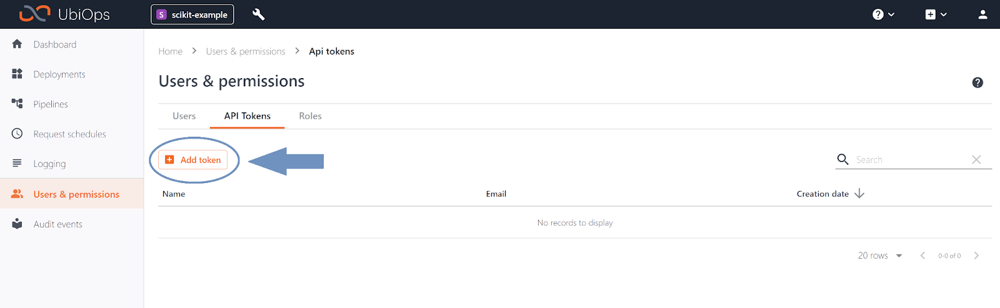

# R-XGboost model template

_Download links for the necessary files: [R-XGboost files](*[xgboost-recipe](https://download-github.ubiops.com/#!/home?url=https://github.com/UbiOps/cookbook/tree/master/r-xgboost-deployment/r-xgboost-deployment)*)

In this example we will show the following:

How to create a deployment that uses a XGboost model written in R to make predictions on the price of houses, using [data from houses in King County, USA dataset](https://www.kaggle.com/harlfoxem/housesalesprediction) 

# R-XGboost model
 The deployment is made up of the following:
|Deployment|Function|
|-----|-----|
|r-xgboost-deployment|Predict house prices based on data from kc_house_data.csv|

# How does it work?
**Step 1:** Login to your UbiOps account at https://app.ubiops.com/ and create an API token with project editor
admin rights. To do so, click on *Users & permissions* in the navigation panel and then click on *API tokens*.
Click on *create token* to create a new token.

Give your new token a name, save the token in safe place and assign the following roles to the token: project editor and blob admin.
These roles can be assigned on project level.

**Step 2:** Download the [r-xgboost-recipe](https://download-github.ubiops.com/#!/home?url=https://github.com/UbiOps/cookbook/tree/master/r-xgboost-deployment/r-xgboost-deployment) folder and open r-xgboost-template.R. In the script you will find a space to enter your API token and the name of your project in UbiOps. Paste the saved API token in the notebook in the indicated spot and enter the name of the project in your UbiOps environment. The project name can be found on the top of your screen in the WebApp. In the image in step 1 the project name is scikit-example.

**Step 3** Run the R script r-xgboost-template and everything will be automatically deployed to your UbiOps environment! When the deployment has finished building (this takes about 15 minutes) it is possible to make a request with the dummy_data.csv, that is also in the r-xgboost-recipe folder. Afterwards you can explore the code in the script or explore the application in the WebApp.
